# Mermaid图表代码映射参考

本文档提供了Mermaid图表到代码的详细映射示例，供技能执行时参考使用。

## 目录

- [1. 流程图映射](#1-流程图映射)
- [2. 时序图映射](#2-时序图映射)
- [3. 类图映射](#3-类图映射)
- [4. 状态图映射](#4-状态图映射)
- [5. ER图映射](#5-er图映射)

---

## 1. 流程图映射

### 1.1 决策节点映射

**Mermaid流程图：**
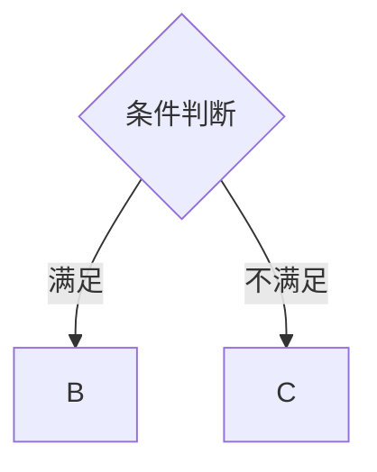

**对应后端代码（TypeScript示例）：**
```typescript
async function processDecision() {
    const conditionMet = await checkCondition();
    if (conditionMet) {
        await processB();  // B的代码
    } else {
        await processC();  // C的代码
    }
}
```

**对应前端代码（Vue3示例）：**
```typescript
const handleAction = async () => {
    const conditionMet = await checkCondition();
    if (conditionMet) {
        handleB();
    } else {
        handleC();
    }
};
```

### 1.2 并行处理映射

**Mermaid流程图：**
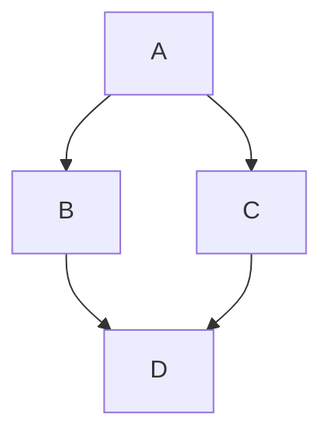

**对应后端代码（异步并行）：**
```typescript
async function processParallel() {
    await processA();
    const [resultB, resultC] = await Promise.all([
        processB(),
        processC()
    ]);
    return await processD(resultB, resultC);
}
```

**对应后端代码（多线程）：**
```typescript
function processParallel() {
    processA();
    const threadB = new Thread(processB);
    const threadC = new Thread(processC);
    threadB.join();
    threadC.join();
    processD(threadB.getResult(), threadC.getResult());
}
```

### 1.3 循环节点映射

**Mermaid流程图（do-while循环）：**
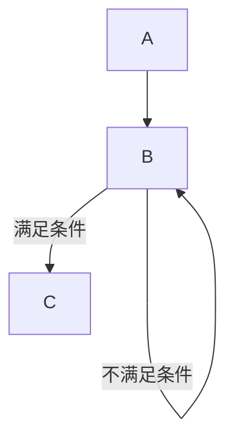

**对应后端代码：**
```typescript
async function processWithRetry(maxRetries = 3) {
    let retries = 0;
    do {
        try {
            const result = await processB();
            return await processC(result);
        } catch (error) {
            retries++;
            if (retries >= maxRetries) {
                throw error;
            }
            await sleep(1000 * retries);  // 指数退避
        }
    } while (retries < maxRetries);
}
```

### 1.4 多层嵌套决策映射

**Mermaid流程图：**
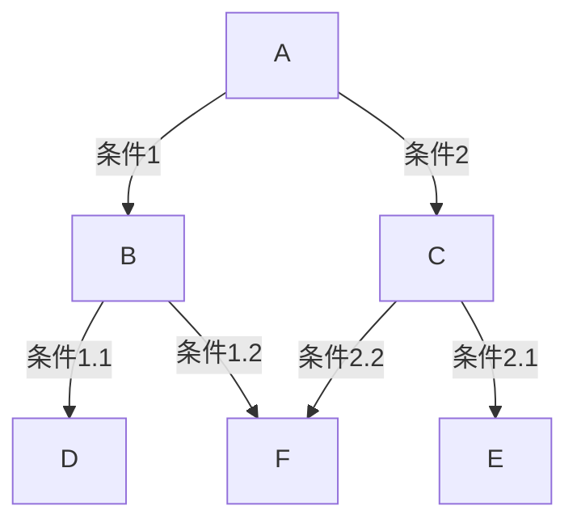

**对应后端代码（使用策略模式）：**
```typescript
interface ProcessStrategy {
    process(): Promise<Result>;
}

class StrategyFactory {
    static create(condition1: boolean, condition2: boolean): ProcessStrategy {
        if (condition1) {
            return condition1 ? new StrategyBD() : new StrategyBF();
        } else {
            return condition2 ? new StrategyCE() : new StrategyCF();
        }
    }
}

async function processComplex() {
    const condition1 = await checkCondition1();
    const condition2 = await checkCondition2();
    const strategy = StrategyFactory.create(condition1, condition2);
    return await strategy.process();
}
```

---

## 2. 时序图映射

### 2.1 服务调用映射

**Mermaid时序图：**
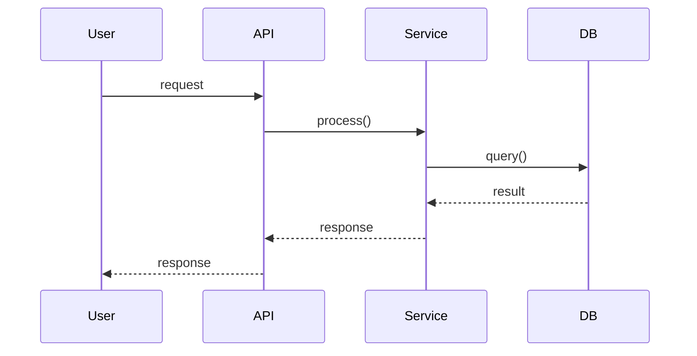

**对应后端代码（分层架构）：**
```typescript
// Controller层 (API)
@Post('/api/order')
async createOrder(@Body() dto: CreateOrderDto): Promise<OrderResponse> {
    return await this.orderService.createOrder(dto);
}

// Service层
async createOrder(dto: CreateOrderDto): Promise<Order> {
    this.validateOrder(dto);
    const user = await this.orderRepository.findById(dto.userId);
    const product = await this.productRepository.findById(dto.productId);

    const order = new Order();
    order.userId = dto.userId;
    order.productId = dto.productId;
    order.amount = product.price * dto.quantity;

    return await this.orderRepository.save(order);
}

// Repository层 (DB)
async findById(id: string): Promise<User | null> {
    return await this.userModel.findOne({ id });
}
```

### 2.2 异步消息映射

**Mermaid时序图（虚线表示异步）：**
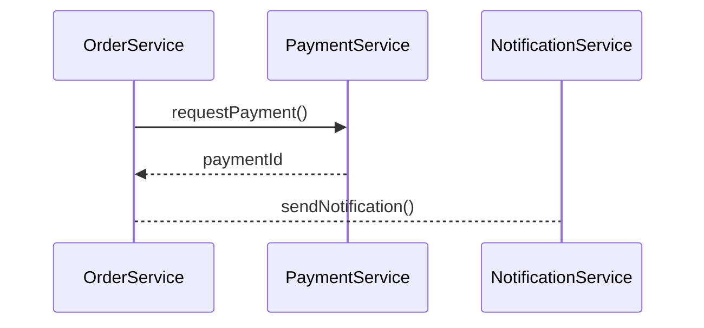

**对应后端代码（消息队列）：**
```typescript
async processOrder(order: Order) {
    // 同步支付
    const paymentResult = await this.paymentService.requestPayment({
        orderId: order.id,
        amount: order.amount
    });

    // 异步通知（使用消息队列）
    await this.messageQueue.publish('order.created', {
        orderId: order.id,
        paymentId: paymentResult.id,
        userId: order.userId
    });
}

// 消息消费者
@MessageHandler('order.created')
async handleOrderCreated(message: OrderCreatedMessage) {
    await this.notificationService.sendNotification({
        userId: message.userId,
        type: 'order_created',
        data: { orderId: message.orderId }
    });
}
```

### 2.3 条件分支映射

**Mermaid时序图：**
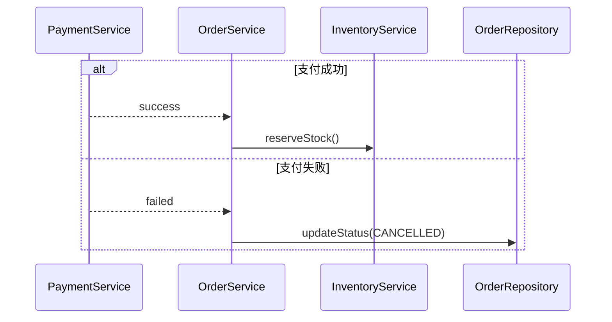

**对应后端代码：**
```typescript
async processPayment(orderId: string) {
    const order = await this.orderRepository.findById(orderId);

    try {
        const paymentResult = await this.paymentService.process(order);
        // 支付成功分支
        await this.inventoryService.reserveStock(order.items);
        order.status = OrderStatus.PAID;
    } catch (error) {
        // 支付失败分支
        order.status = OrderStatus.CANCELLED;
        order.failureReason = error.message;
    }

    await this.orderRepository.save(order);
}
```

### 2.4 循环映射

**Mermaid时序图：**
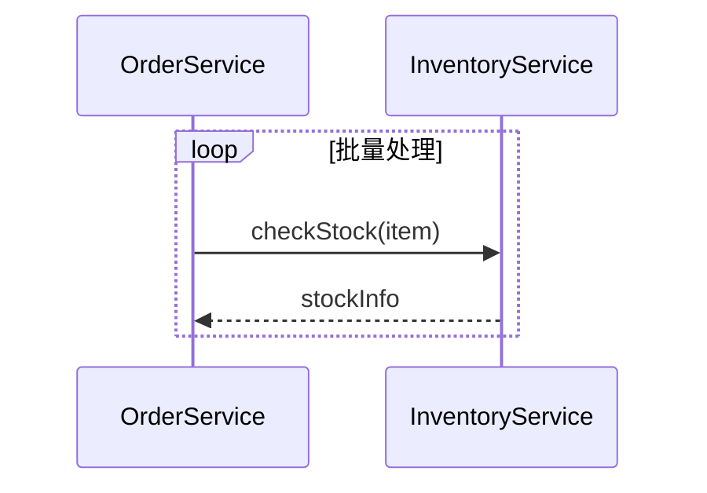

**对应后端代码：**
```typescript
async processBatchOrder(order: Order) {
    const items = order.items;
    const stockResults = [];

    for (const item of items) {
        const stockInfo = await this.inventoryService.checkStock(item);
        stockResults.push({ item, stockInfo });
    }

    return stockResults;
}
```

---

## 3. 类图映射

### 3.1 基础类映射

**Mermaid类图：**
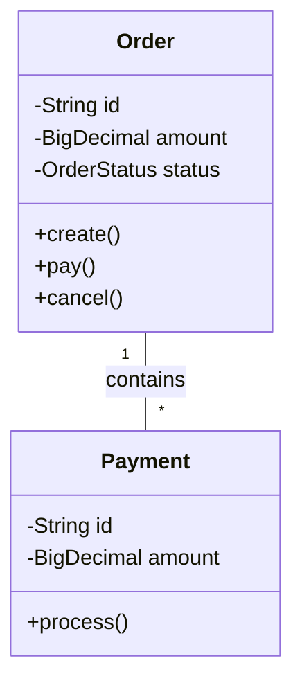

**对应后端代码（TypeScript）：**
```typescript
enum OrderStatus {
    PENDING = 'PENDING',
    PAID = 'PAID',
    CANCELLED = 'CANCELLED'
}

class Order {
    private id: string;
    private amount: number;
    private status: OrderStatus;
    private payments: Payment[] = [];

    constructor(amount: number) {
        this.id = generateId();
        this.amount = amount;
        this.status = OrderStatus.PENDING;
    }

    static create(amount: number): Order {
        return new Order(amount);
    }

    pay(payment: Payment): void {
        if (payment.getAmount() !== this.amount) {
            throw new Error('Payment amount does not match order amount');
        }
        payment.process();
        this.payments.push(payment);
        this.status = OrderStatus.PAID;
    }

    cancel(): void {
        if (this.status === OrderStatus.PAID) {
            throw new Error('Cannot cancel a paid order');
        }
        this.status = OrderStatus.CANCELLED;
    }

    getId(): string { return this.id; }
    getAmount(): number { return this.amount; }
    getStatus(): OrderStatus { return this.status; }
    getPayments(): Payment[] { return [...this.payments]; }
}

class Payment {
    private id: string;
    private amount: number;
    private processed: boolean = false;

    constructor(amount: number) {
        this.id = generateId();
        this.amount = amount;
    }

    process(): void {
        if (this.processed) {
            throw new Error('Payment already processed');
        }
        this.processed = true;
    }

    getId(): string { return this.id; }
    getAmount(): number { return this.amount; }
}
```

### 3.2 继承关系映射

**Mermaid类图：**
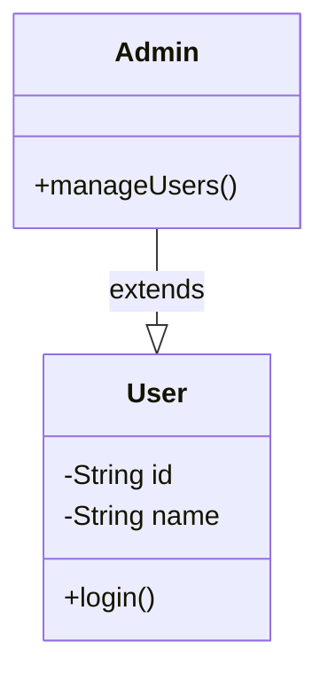

**对应后端代码：**
```typescript
abstract class User {
    protected id: string;
    protected name: string;

    constructor(id: string, name: string) {
        this.id = id;
        this.name = name;
    }

    abstract login(): Promise<boolean>;

    getId(): string { return this.id; }
    getName(): string { return this.name; }
}

class Admin extends User {
    constructor(id: string, name: string) {
        super(id, name);
    }

    async login(): Promise<boolean> {
        return await this.authenticateAsAdmin();
    }

    async manageUsers(): Promise<void> {
        // 管理员管理用户逻辑
    }

    private async authenticateAsAdmin(): Promise<boolean> {
        return true;
    }
}
```

### 3.3 接口实现映射

**Mermaid类图：**
```mermaid
classDiagram
    interface PaymentProcessor {
        +process(amount: BigDecimal): Promise<boolean>
    }
    class CreditCardProcessor {
        +process(amount: BigDecimal): Promise<boolean>
    }
    class WechatPayProcessor {
        +process(amount: BigDecimal): Promise<boolean>
    }
    CreditCardProcessor ..|> PaymentProcessor
    WechatPayProcessor ..|> PaymentProcessor
```

**对应后端代码：**
```typescript
interface PaymentProcessor {
    process(amount: number): Promise<PaymentResult>;
}

interface PaymentResult {
    success: boolean;
    transactionId?: string;
    error?: string;
}

class CreditCardProcessor implements PaymentProcessor {
    async process(amount: number): Promise<PaymentResult> {
        try {
            const transactionId = await this.callPaymentGateway(amount);
            return { success: true, transactionId };
        } catch (error) {
            return { success: false, error: error.message };
        }
    }

    private async callPaymentGateway(amount: number): Promise<string> {
        return 'tx_' + generateId();
    }
}

class WechatPayProcessor implements PaymentProcessor {
    async process(amount: number): Promise<PaymentResult> {
        try {
            const transactionId = await this.callWechatPay(amount);
            return { success: true, transactionId };
        } catch (error) {
            return { success: false, error: error.message };
        }
    }

    private async callWechatPay(amount: number): Promise<string> {
        return 'wx_' + generateId();
    }
}
```

---

## 4. 状态图映射

### 4.1 完整状态机实现

**Mermaid状态图：**
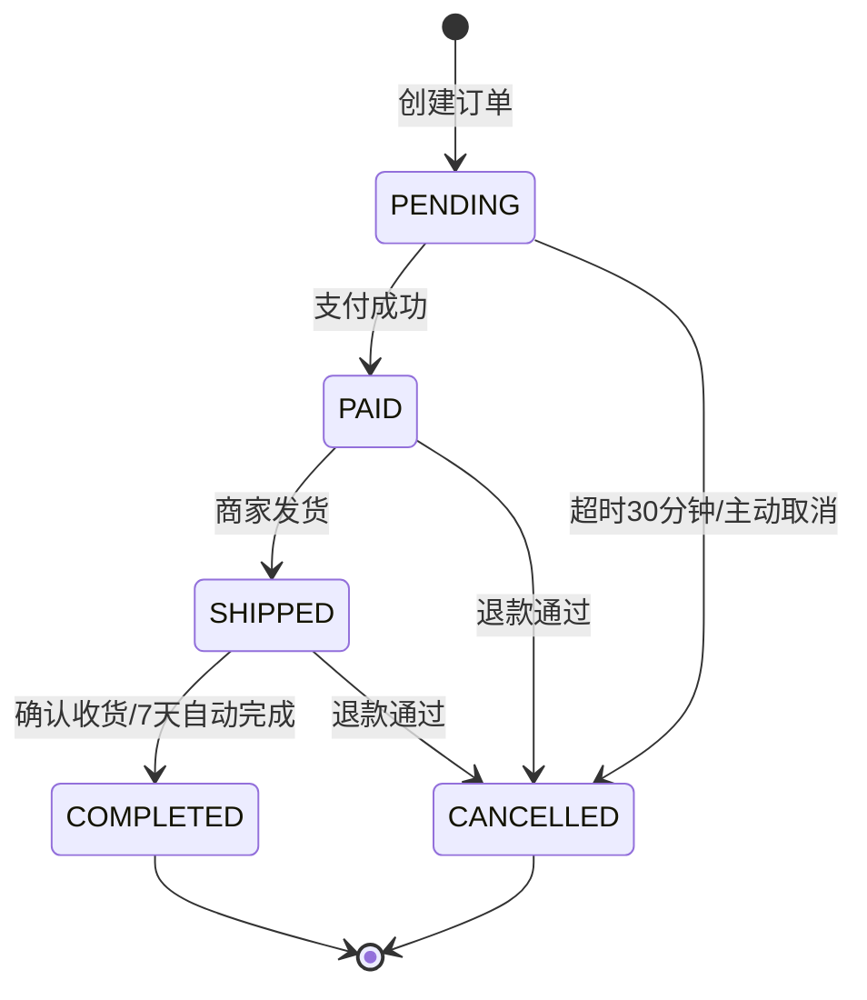

**对应后端代码（完整状态机实现）：**
```typescript
enum OrderStatus {
    PENDING = 'PENDING',
    PAID = 'PAID',
    SHIPPED = 'SHIPPED',
    COMPLETED = 'COMPLETED',
    CANCELLED = 'CANCELLED'
}

// 状态转换规则定义
const ORDER_STATE_TRANSITIONS: Record<OrderStatus, OrderStatus[]> = {
    [OrderStatus.PENDING]: [OrderStatus.PAID, OrderStatus.CANCELLED],
    [OrderStatus.PAID]: [OrderStatus.SHIPPED, OrderStatus.CANCELLED],
    [OrderStatus.SHIPPED]: [OrderStatus.COMPLETED, OrderStatus.CANCELLED],
    [OrderStatus.COMPLETED]: [],
    [OrderStatus.CANCELLED]: []
};

// 状态历史记录
interface OrderStatusHistory {
    status: OrderStatus;
    previousStatus: OrderStatus | null;
    timestamp: Date;
    operator: string;
    reason?: string;
}

// 状态机类
class OrderStateMachine {
    private status: OrderStatus;
    private history: OrderStatusHistory[] = [];

    constructor(initialStatus: OrderStatus) {
        this.status = initialStatus;
        this.history.push({
            status: initialStatus,
            previousStatus: null,
            timestamp: new Date(),
            operator: 'system'
        });
    }

    /**
     * 状态转换方法
     */
    async transition(
        targetStatus: OrderStatus,
        operator: string,
        reason?: string
    ): Promise<void> {
        const currentStatus = this.status;

        // 验证转换是否合法
        if (!this.canTransition(currentStatus, targetStatus)) {
            throw new InvalidStateTransitionError(
                `Cannot transition from ${currentStatus} to ${targetStatus}`
            );
        }

        // 执行退出动作
        await this.onExit(currentStatus);

        // 更新状态
        this.status = targetStatus;
        this.history.push({
            status: targetStatus,
            previousStatus: currentStatus,
            timestamp: new Date(),
            operator,
            reason
        });

        // 执行入口动作
        await this.onEnter(targetStatus);
    }

    /**
     * 检查状态转换是否合法
     */
    canTransition(from: OrderStatus, to: OrderStatus): boolean {
        return ORDER_STATE_TRANSITIONS[from]?.includes(to) ?? false;
    }

    /**
     * 获取合法的目标状态列表
     */
    getAllowedTransitions(): OrderStatus[] {
        return ORDER_STATE_TRANSITIONS[this.status] ?? [];
    }

    /**
     * 状态退出时的处理（钩子）
     */
    private async onExit(status: OrderStatus): Promise<void> {
        switch (status) {
            case OrderStatus.PENDING:
                await this.cancelTimeoutTask();
                break;
            case OrderStatus.SHIPPED:
                await this.recordShipmentEnd();
                break;
        }
    }

    /**
     * 状态进入时的处理（钩子）
     */
    private async onEnter(status: OrderStatus): Promise<void> {
        switch (status) {
            case OrderStatus.PENDING:
                await this.scheduleAutoCancellation();
                break;
            case OrderStatus.PAID:
                await this.sendPaymentSuccessNotification();
                break;
            case OrderStatus.SHIPPED:
                await this.sendShipmentNotification();
                await this.scheduleAutoCompletion();
                break;
            case OrderStatus.COMPLETED:
                await this.sendCompletionNotification();
                await this.updateStatistics();
                break;
            case OrderStatus.CANCELLED:
                await this.processRefund();
                await this.sendCancellationNotification();
                break;
        }
    }

    getStatus(): OrderStatus {
        return this.status;
    }

    getHistory(): OrderStatusHistory[] {
        return [...this.history];
    }

    private async cancelTimeoutTask(): Promise<void> {}
    private async scheduleAutoCancellation(): Promise<void> {}
    private async scheduleAutoCompletion(): Promise<void> {}
    private async sendPaymentSuccessNotification(): Promise<void> {}
    private async sendShipmentNotification(): Promise<void> {}
    private async sendCompletionNotification(): Promise<void> {}
    private async sendCancellationNotification(): Promise<void> {}
    private async processRefund(): Promise<void> {}
    private async recordShipmentEnd(): Promise<void> {}
    private async updateStatistics(): Promise<void> {}
}

class InvalidStateTransitionError extends Error {
    constructor(message: string) {
        super(message);
        this.name = 'InvalidStateTransitionError';
    }
}
```

### 4.2 并发状态映射

**Mermaid状态图（并发状态）：**
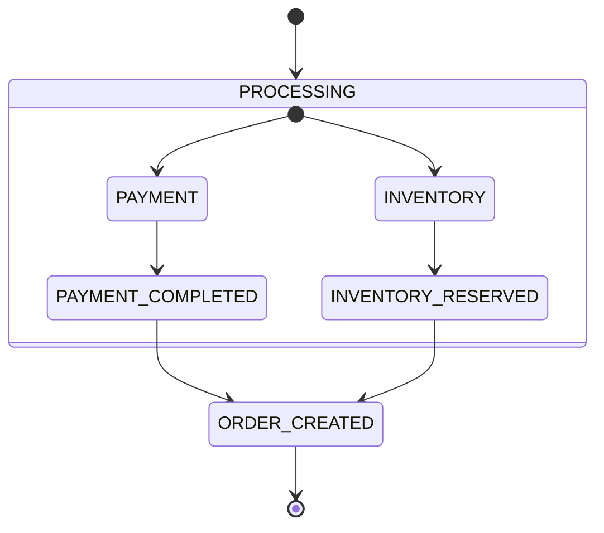

**对应后端代码（多状态机并行）：**
```typescript
class PaymentStateMachine {
    private state: 'PENDING' | 'PROCESSING' | 'COMPLETED' | 'FAILED' = 'PENDING';

    transition(target: 'PROCESSING' | 'COMPLETED' | 'FAILED'): void {
        const validTransitions: Record<string, string[]> = {
            'PENDING': ['PROCESSING'],
            'PROCESSING': ['COMPLETED', 'FAILED'],
            'COMPLETED': [],
            'FAILED': []
        };
        if (!validTransitions[this.state].includes(target)) {
            throw new Error(`Invalid payment state transition`);
        }
        this.state = target;
    }

    getState(): string { return this.state; }
    isCompleted(): boolean { return this.state === 'COMPLETED'; }
}

class InventoryStateMachine {
    private state: 'PENDING' | 'RESERVING' | 'RESERVED' | 'FAILED' = 'PENDING';

    transition(target: 'RESERVING' | 'RESERVED' | 'FAILED'): void {
        const validTransitions: Record<string, string[]> = {
            'PENDING': ['RESERVING'],
            'RESERVING': ['RESERVED', 'FAILED'],
            'RESERVED': [],
            'FAILED': []
        };
        if (!validTransitions[this.state].includes(target)) {
            throw new Error(`Invalid inventory state transition`);
        }
        this.state = target;
    }

    getState(): string { return this.state; }
    isReserved(): boolean { return this.state === 'RESERVED'; }
}

// 并行状态管理器
class ParallelOrderStateMachine {
    private payment: PaymentStateMachine;
    private inventory: InventoryStateMachine;

    constructor() {
        this.payment = new PaymentStateMachine();
        this.inventory = new InventoryStateMachine();
    }

    async processPayment(): Promise<void> {
        this.payment.transition('PROCESSING');
        this.payment.transition('COMPLETED');
    }

    async reserveInventory(): Promise<void> {
        this.inventory.transition('RESERVING');
        this.inventory.transition('RESERVED');
    }

    async processOrder(): Promise<boolean> {
        await Promise.all([
            this.processPayment(),
            this.reserveInventory()
        ]);
        return this.payment.isCompleted() && this.inventory.isReserved();
    }

    getPaymentState(): string { return this.payment.getState(); }
    getInventoryState(): string { return this.inventory.getState(); }
}
```

---

## 5. ER图映射

### 5.1 基础实体关系映射

**Mermaid ER图：**
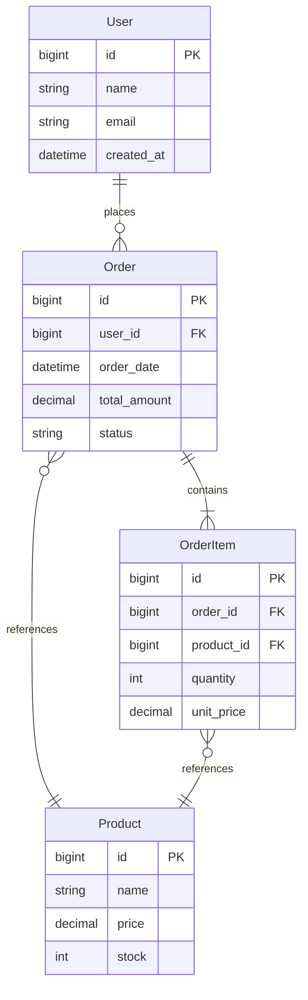

**对应后端代码（TypeScript + TypeORM）：**
```typescript
import {
    Entity,
    PrimaryGeneratedColumn,
    Column,
    CreateDateColumn,
    OneToMany,
    ManyToOne,
    JoinColumn
} from 'typeorm';

@Entity('users')
class User {
    @PrimaryGeneratedColumn()
    id: number;

    @Column()
    name: string;

    @Column({ unique: true })
    email: string;

    @CreateDateColumn()
    createdAt: Date;

    @OneToMany(() => Order, (order) => order.user)
    orders: Order[];
}

@Entity('orders')
class Order {
    @PrimaryGeneratedColumn()
    id: number;

    @Column({ name: 'user_id' })
    userId: number;

    @ManyToOne(() => User, (user) => user.orders)
    @JoinColumn({ name: 'user_id' })
    user: User;

    @Column({ name: 'order_date', type: 'timestamp' })
    orderDate: Date;

    @Column({ type: 'decimal', precision: 10, scale: 2 })
    totalAmount: number;

    @Column()
    status: string;

    @OneToMany(() => OrderItem, (item) => item.order)
    items: OrderItem[];
}

@Entity('order_items')
class OrderItem {
    @PrimaryGeneratedColumn()
    id: number;

    @Column({ name: 'order_id' })
    orderId: number;

    @ManyToOne(() => Order, (order) => order.items)
    @JoinColumn({ name: 'order_id' })
    order: Order;

    @Column({ name: 'product_id' })
    productId: number;

    @ManyToOne(() => Product)
    @JoinColumn({ name: 'product_id' })
    product: Product;

    @Column()
    quantity: number;

    @Column({ name: 'unit_price', type: 'decimal', precision: 10, scale: 2 })
    unitPrice: number;
}

@Entity('products')
class Product {
    @PrimaryGeneratedColumn()
    id: number;

    @Column()
    name: string;

    @Column({ type: 'decimal', precision: 10, scale: 2 })
    price: number;

    @Column()
    stock: number;

    @OneToMany(() => OrderItem, (item) => item.product)
    orderItems: OrderItem[];
}
```

### 5.2 多对多关系映射

**Mermaid ER图：**
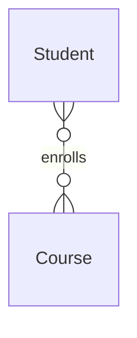

**对应后端代码（通过中间表）：**
```typescript
@Entity('students')
class Student {
    @PrimaryGeneratedColumn()
    id: number;

    @Column()
    name: string;

    @ManyToMany(() => Course, (course) => course.students)
    @JoinTable({
        name: 'student_courses',
        joinColumn: { name: 'student_id' },
        inverseJoinColumn: { name: 'course_id' }
    })
    courses: Course[];
}

@Entity('courses')
class Course {
    @PrimaryGeneratedColumn()
    id: number;

    @Column()
    name: string;

    @Column()
    credits: number;

    @ManyToMany(() => Student, (student) => student.courses)
    students: Student[];
}
```
