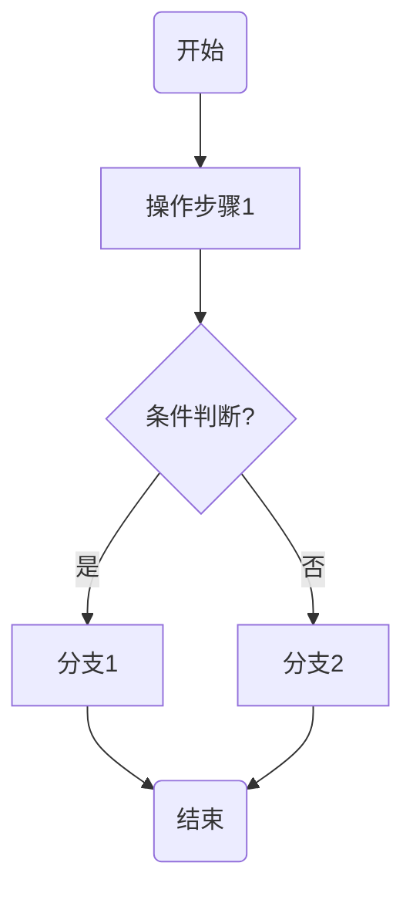
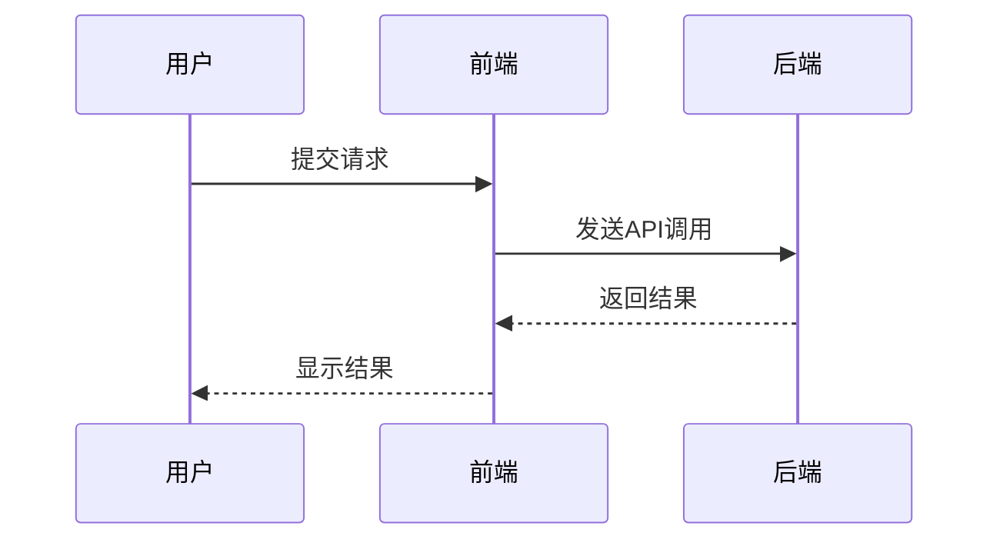
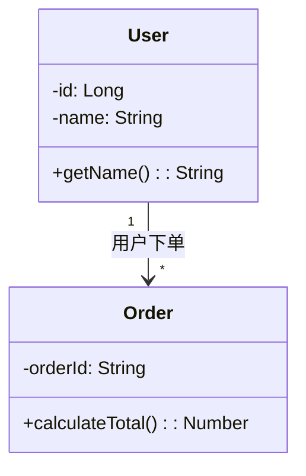
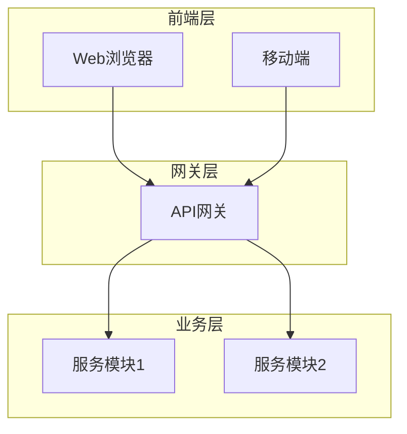

# Mermaid语法快速参考

## 基础规则

- 统一使用英文半角符号
- 关键字推荐使用小写
- 节点ID使用英文+数字+下划线，无空格、中文
- 注释使用 `%%` 开头

## 常用图表类型

### 1. Flowchart（流程图）- 用于业务流程

**节点类型**：
- `start(开始)` / `end(结束)`: 圆角节点，用于流程起始和结束
- `step1[操作步骤]`: 矩形节点，普通操作步骤
- `judge{条件判断?}`: 菱形节点，条件判断

### 2. Sequence Diagram（时序图）- 用于接口交互

**消息类型**：
- `U->>F`: 同步消息（实线箭头）
- `B-->>F`: 返回消息（虚线箭头）

### 3. Class Diagram（类图）- 用于数据模型

**关系符号**：
- `<|--`: 继承关系（子类指向父类）
- `-->`: 关联关系
- `*--`: 聚合关系

### 4. 架构图示例

