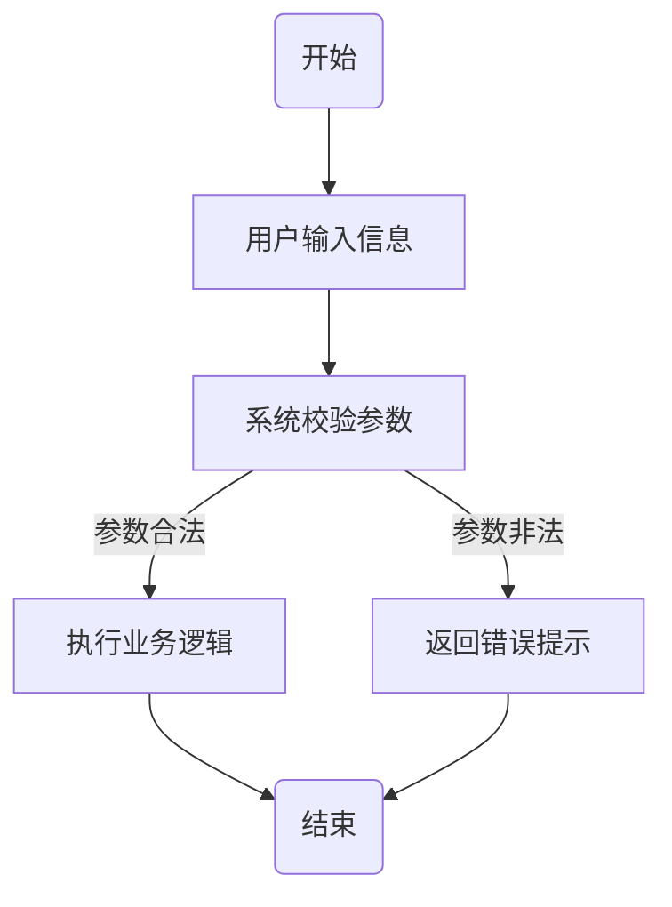
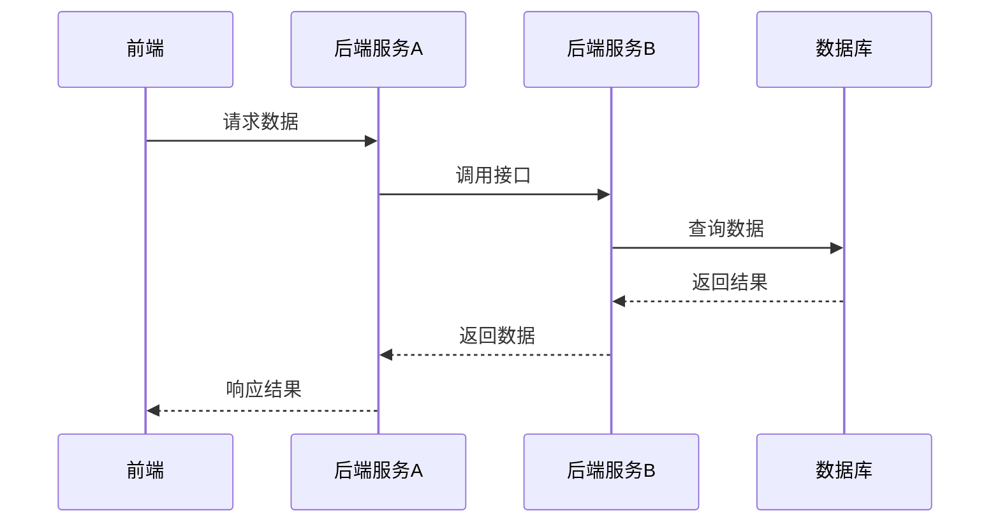
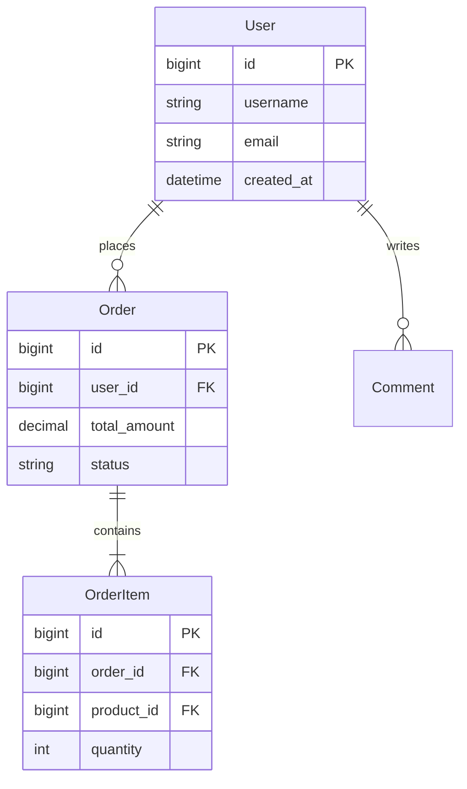

## 一、引言
### 1.1 系统概述
[简洁说明软件核心用途和解决的问题，描述系统的主要功能范围和应用领域]

#### 1.2 开发目标
[明确说明本系统的开发目标，包括要实现的核心功能、解决的业务痛点、预期达到的技术指标等]

### 1.3 开发时间
[填写开发周期，如：2024年1月 至 2024年12月]

### 1.4 运行环境
- 操作系统：[Windows Server 2019 / Linux CentOS 7 / macOS等]
- 硬件配置：[根据系统性能需求填写，如 CPU ≥ 4 核，内存 ≥ 8GB，硬盘 ≥ 50GB；分布式部署需补充节点数量 / 配置]
- 依赖软件 / 框架：[根据系统架构设计适配选择，示例：
后端：Python 3.x/ Java 17 / Go 1.x、Django 4.x/ SpringBoot 3.x/ Gin 1.x、MySQL 8.0 / Redis 7.0
前端：Node.js 18.x、Vue 3.x/ React 18.x、Vite 4.x
中间件：Nginx 1.24 / Kafka 3.6 / Elasticsearch 8.x
容器化：Docker 24.x/ Kubernetes 1.28
]

### 1.5 参考资料
1. [国家标准/行业标准名称，如：GB/T 8567-2006 计算机软件文档编制规范]
2. [技术文档名称，如：Django官方文档 https://docs.djangoproject.com/]
3. [其他参考资源，如行业解决方案、竞品分析报告、业务需求文档等]

## 二、软件总体设计

### 2.1 架构设计

[在此处插入Mermaid架构图，可根据架构类型选择：分层架构、微服务架构、事件驱动架构等]

**架构说明**：
- [分层说明：用户交互层、业务逻辑层、数据访问层、数据存储层 / 基础设施层等，适配实际架构分层]
- [核心组件说明：各层 / 各服务的主要组件及其职责、组件间交互方式]

### 2.2 核心功能概述

本系统包含[3-8]个核心功能模块，简要说明如下：

1. **[功能模块1名称]**：[功能描述]
2. **[功能模块2名称]**：[功能描述]
3. **[功能模块3名称]**：[功能描述]
...

## 三、详细功能设计

### 3.1 [模块名称]

#### 功能描述
[详细描述该模块的功能、业务价值、边界范围及异常处理规则]

#### 业务流程 / 交互时序
[根据功能模块的特性选择以下任一 / 组合图类型进行绘制，并补充图说明]
- 业务流程图（适用于线性业务流程、状态流转场景）：


- 交互时序图（适用于多角色 / 多服务交互、异步调用场景）：

#### 图说明：
[描述流程图/时序图的核心逻辑、关键节点、异常分支等]

#### 输入输出
- **输入**：[列出该模块的输入参数]
- **输出**：[列出该模块的输出结果]

### 3.2 [其他模块名称]

...

## 四、技术实现说明

### 4.1 核心技术选型

#### 后端技术栈
- **开发语言**：[根据架构 / 性能 / 团队技术栈选择，如 Python 3.x/ Java 17 / Go 1.x/ Rust 1.x]
- **Web框架**：[适配语言及场景，如 Django 4.2 / SpringBoot 3.x/ Gin 1.x/ FastAPI 0.100.x]
- **数据库**：[根据数据特性选择，如 MySQL 8.0（关系型）/ PostgreSQL 14（复杂查询）/ MongoDB 5.x（非结构化）/ Redis 7.0（缓存）]
- **ORM框架**：[适配框架 / 数据库，如 Django ORM / MyBatis / GORM / SQLAlchemy]
- **异步任务**：[适配场景，如 Celery 5.x/ RabbitMQ / Kafka / RocketMQ]
- **API文档**：[Swagger / OpenAPI]
- **数据验证**：[Pydantic / Bean Validation]

#### 前端技术栈
- **开发语言**：[JavaScript (ES6+) / TypeScript 5.x]
- **框架**：[Vue 3.x（组合式 API）/ React 18.x（Hooks）/ Svelte 4.x]
- **UI组件库**：[Element Plus / Ant Design / Material-UI / Tailwind UI]
- **图表库**：[ECharts 5.x（大数据可视化）/ Chart.js（轻量）/ D3.js（自定义可视化）]
- **状态管理**：[Pinia / Vuex / Redux]
- **HTTP客户端**：[Axios / Fetch]
- **构建工具**：[Vite 4.x / Webpack 5.x]

#### 选型理由
- [技术栈1]：[结合业务场景（如高并发 / 高可用 / 低延迟）、团队熟练度、生态完善度、性能指标、成本等理由说明]
- [技术栈2]：[理由说明]
...

### 4.2 关键技术点实现逻辑

#### [关键技术点1名称]实现
**业务背景**：[该技术点解决的核心问题 / 业务痛点]
**实现思路**：[核心逻辑、算法、设计模式等]
**性能 / 安全考量**：[如缓存策略、并发控制、加密方式、限流措施等]
#### [关键技术点2名称]实现
...

## 五、运行测试说明

### 5.1 测试环境
- 操作系统：[与1.4运行环境一致]
- 硬件配置：[与1.4运行环境一致]
- 依赖软件：[与1.4运行环境一致]

### 5.2 测试用例

#### 测试用例1：[测试名称]
- **测试目的**：[说明测试的目标]
- **输入**：[列出测试输入数据]
- **预期结果**：[说明预期的测试结果]
- **实际结果**：[记录实际测试结果，测试通过/失败]

#### 测试用例2：[测试名称]
...

#### 测试用例3：[测试名称]
...

## 六、软件功能列表

| 一级功能 | 二级功能 | 功能说明 |
|---------|---------|---------|
| [功能模块1] | [子功能1] | [功能说明] |
| | [子功能2] | [功能说明] |
| [功能模块2] | [子功能3] | [功能说明] |
...

## 七、数据库设计

### 7.1 表结构设计

[根据数据存储类型选择：关系型数据库表结构 / 非关系型数据库集合结构]

#### 7.1.1 [表名1]（如：users表）

| 字段名 | 数据类型 | 长度 | 是否主键 | 是否非空 | 默认值 | 说明 |
|-------|---------|-----|---------|---------|--------|------|
| id | BIGINT | - | 是 | 是 | AUTO_INCREMENT | 用户唯一标识 |
| username | VARCHAR | 50 | 否 | 是 | - | 用户名 |
| password | VARCHAR | 255 | 否 | 是 | - | 密码（加密存储） |
| email | VARCHAR | 100 | 否 | 是 | - | 邮箱地址 |
| created_at | DATETIME | - | 否 | 是 | CURRENT_TIMESTAMP | 创建时间 |
| updated_at | DATETIME | - | 否 | 是 | CURRENT_TIMESTAMP ON UPDATE CURRENT_TIMESTAMP | 更新时间 |

**索引设计**：
- PRIMARY KEY: id
- UNIQUE KEY: username
- UNIQUE KEY: email
- INDEX: created_at

**表说明**
[描述表的业务含义、数据写入 / 更新规则、分表策略（可选）]

#### 7.1.2 [表名2]
[按上述格式继续描述其他表结构]

...

### 7.2 实体关系图（ER图）

[在此处插入 Mermaid ER 图，展示核心实体及其关系；非关系型数据库可替换为数据模型图]



**实体关系说明**：
- [User与Order的关系]：一对多，一个用户可以下多个订单
- [Order与OrderItem的关系]：一对多，一个订单包含多个订单项
...

## 八、接口文档

本系统采用RESTful API风格，以下为各核心模块的接口定义：

### 8.1 [模块名称1]接口

#### 8.1.1 获取[资源]列表

- **接口路径**：`GET /api/[module-name]`
- **接口描述**：获取[资源]列表，支持分页查询
- **请求参数**：

| 参数名 | 类型 | 必填 | 说明 |
|-------|------|------|------|
| page | Integer | 否 | 页码，默认为1 |
| page_size | Integer | 否 | 每页数量，默认为20 |
| keyword | String | 否 | 搜索关键字 |

- **响应示例**：

```json
{
    "code": 200,
    "message": "success",
    "data": {
        "total": 100,
        "page": 1,
        "page_size": 20,
        "items": [
            {
                "id": 1,
                "name": "示例名称",
                "created_at": "2024-01-01T00:00:00Z"
            }
        ]
    }
}
```

#### 8.1.2 创建[资源]

- **接口路径**：`POST /api/[module-name]`
- **接口描述**：创建新的[资源]
- **请求体**：

```json
{
    "name": "资源名称",
    "description": "资源描述",
    "status": "active"
}
```

- **响应示例**：

```json
{
    "code": 200,
    "message": "创建成功",
    "data": {
        "id": 1,
        "name": "资源名称",
        "created_at": "2024-01-01T00:00:00Z"
    }
}
```

#### 8.1.3 获取[资源]详情

- **接口路径**：`GET /api/[module-name]/{id}`
- **接口描述**：根据ID获取[资源]详情
- **路径参数**：

| 参数名 | 类型 | 必填 | 说明 |
|-------|------|------|------|
| id | Integer | 是 | 资源ID |

- **响应示例**：

```json
{
    "code": 200,
    "message": "success",
    "data": {
        "id": 1,
        "name": "资源名称",
        "description": "资源描述",
        "created_at": "2024-01-01T00:00:00Z",
        "updated_at": "2024-01-01T00:00:00Z"
    }
}
```

#### 8.1.4 更新[资源]

- **接口路径**：`PUT /api/[module-name]/{id}`
- **接口描述**：更新指定ID的[资源]信息
- **路径参数**：

| 参数名 | 类型 | 必填 | 说明 |
|-------|------|------|------|
| id | Integer | 是 | 资源ID |

- **请求体**：

```json
{
    "name": "更新后的名称",
    "description": "更新后的描述"
}
```

#### 8.1.5 删除[资源]

- **接口路径**：`DELETE /api/[module-name]/{id}`
- **接口描述**：删除指定ID的[资源]
- **路径参数**：

| 参数名 | 类型 | 必填 | 说明 |
|-------|------|------|------|
| id | Integer | 是 | 资源ID |

- **响应示例**：

```json
{
    "code": 200,
    "message": "删除成功"
}
```

### 8.2 [模块名称2]接口

[按上述格式继续描述其他模块的接口]

...

### 8.3 通用错误码说明

| 错误码 | HTTP状态码 | 说明 |
|-------|-----------|------|
| 200 | 200 | 请求成功 |
| 400 | 400 | 请求参数错误 |
| 401 | 401 | 未授权，需要登录 |
| 403 | 403 | 禁止访问，权限不足 |
| 404 | 404 | 资源不存在 |
| 500 | 500 | 服务器内部错误 |
